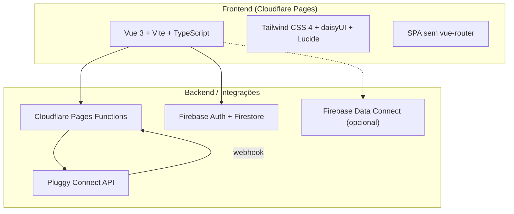
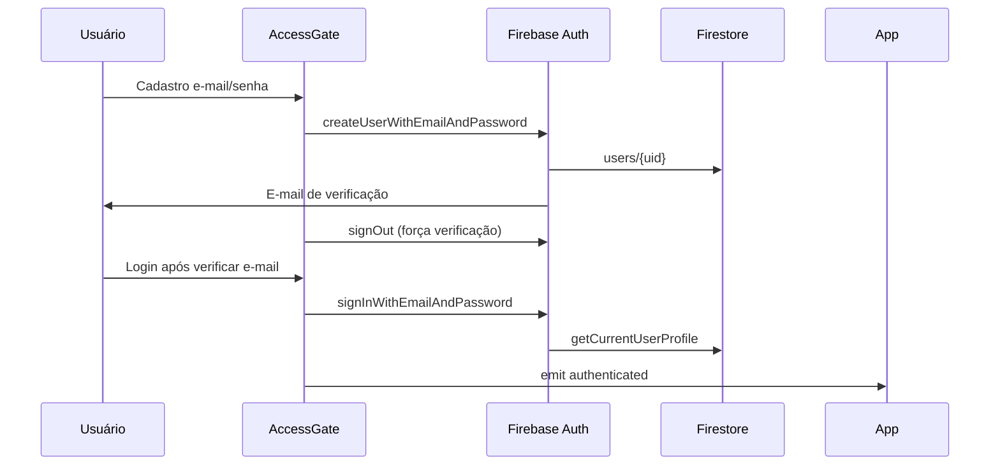
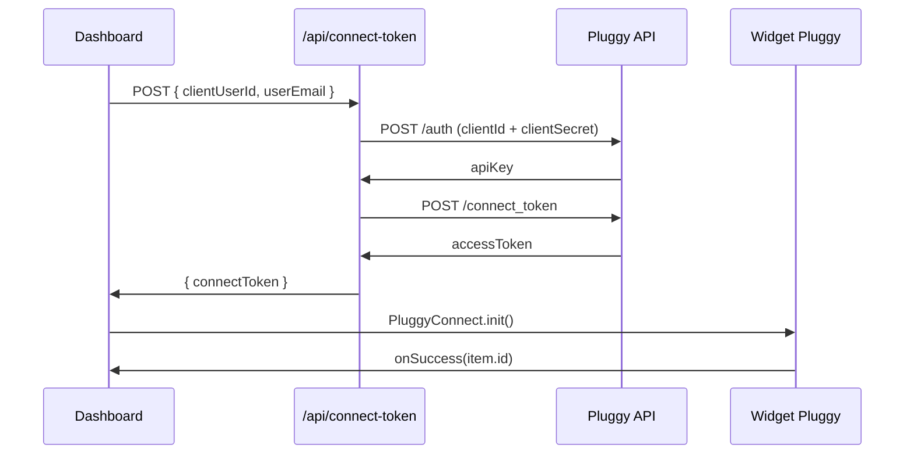

# Auditoria geral — iFinanca

Visitei o repositório e o site em produção em [https://ifinanca.pages.dev/]. Abaixo está um mapa do projeto, do que já funciona e do que ainda é protótipo.

---

## Resumo executivo

**iFinanca** é uma plataforma de gestão financeira pessoal com visual inspirado no Meu Pluggy. O produto já tem:

- landing page e cadastro/login funcionais em produção;
- autenticação real via Firebase;
- perfil persistido no Firestore;
- integração Pluggy parcial (widget de conexão bancária);
- dashboard rico em UI, mas alimentado principalmente por **dados mockados**.

Em termos de maturidade: **MVP visual + auth real + esqueleto de Open Finance**, ainda sem pipeline completo Pluggy → dados reais no dashboard.

---

## O que o projeto faz

| Área | Status |
| --- | --- |
| Cadastro/login (e-mail + Google) | Implementado |
| Verificação de e-mail obrigatória | Implementado |
| Perfil do usuário (nome, objetivo, renda, avatar) | Firestore |
| Dashboard (saldo, fluxo, ativos, conexões) | UI completa, dados mock |
| Conexão bancária Pluggy | Widget funcional; dados não refletem no dashboard |
| Webhook Pluggy | Recebe eventos; só registra em log |
| Firebase Data Connect | Opcional; schema pronto, uso parcial |
| i18n (PT / EN / ES) + tema claro/escuro | Implementado |

---

## Stack tecnológica



| Camada | Tecnologia |
| --- | --- |
| Frontend | Vue 3, Vite 8, TypeScript 6, Tailwind 4, daisyUI |
| Hospedagem | Cloudflare Pages (`ifinanca.pages.dev`) |
| Auth + DB | Firebase Auth + Firestore (`users/{uid}`) |
| Open Finance | Pluggy Connect via Pages Function |
| Backend opcional | Firebase Data Connect (GraphQL) |
| Testes | Vitest (unit) + Playwright (e2e mínimo) |
| Node | 24.15.0 (`.nvmrc` e `.node-version`) |

---

## Estrutura do código (~61 arquivos)

```bash
src/
├── App.vue              # Orquestrador: auth, tema, idioma, roteamento condicional
├── components/
│   ├── AccessGate.vue   # Landing + cadastro/login (~516 linhas)
│   └── FinanceDashboard.vue  # Dashboard completo (~912 linhas)
├── services/
│   ├── firebase.ts      # Auth, Firestore, App Check
│   ├── pluggy.ts        # Widget Pluggy Connect
│   └── dataconnect.ts   # GraphQL opcional
├── data/finance.ts      # Dados mock (bancos, transações, ativos)
├── types/finance.ts     # Tipos de domínio
└── i18n.ts              # Traduções PT/EN/ES

functions/api/           # Cloudflare Pages Functions
├── connect-token.ts     # POST /api/connect-token
├── verify-recaptcha.ts  # POST /api/verify-recaptcha
└── webhooks/pluggy.ts   # POST /api/webhooks/pluggy

dataconnect/             # Schema GraphQL (User, Transaction)
firestore.rules          # Regras de segurança do Firestore
```

Não há `vue-router`: a navegação é condicional em `App.vue` (loading → `AccessGate` → `FinanceDashboard`).

---

## Fluxos principais

### 1. Autenticação



Regras importantes:

- cadastro por e-mail **não abre o dashboard** até `emailVerified === true`;
- Google usa popup e cria perfil no primeiro acesso;
- perfil também fica em `localStorage` (`ifinanca.profile`).

### 2. Dashboard

O dashboard tem 4 abas:

- **Visão geral** — saldo, contas, transações recentes
- **Fluxo** — receitas/despesas
- **Ativos** — carteira de investimentos
- **Conexões** — bancos + botão Pluggy

Por padrão, saldos, bancos e transações vêm de `src/data/finance.ts` (Bradesco, Nubank, Itaú, Caixa com valores fixos). Se `VITE_FIREBASE_DATACONNECT_ENDPOINT` estiver configurado, tenta carregar transações reais; senão, mantém o mock.

### 3. Pluggy Connect



O `itemId` retornado é exibido na aba Conexões, mas **não atualiza saldos nem transações**. Se a API falhar, `pluggy.ts` cai silenciosamente em **modo demo** (`createDemoResult()`).

### 4. Webhook Pluggy

A function em `functions/api/webhooks/pluggy.ts` trata `item/created`, `item/updated` e `item/error`, mas hoje **só faz `console.log`**. Não grava no Firestore nem dispara sync de transações.

---

## Site em produção

Em ifinanca.pages.dev o app está no ar e consistente com o código:

- landing escura com identidade visual verde (`#17c964`);
- mockup mobile com saldo R$ 61.624,08;
- formulário de cadastro com Firebase Auth;
- badges Vue / Firebase / Pluggy;
- seletor de idioma (PT ativo);
- reCAPTCHA Enterprise carregando (“Carregando verificação de segurança...”);
- botão “Criar conta segura” desabilitado até o formulário ser válido.

---

## Segurança — pontos positivos

1. **Segredos Pluggy no servidor** — `PLUGGY_CLIENT_ID` e `PLUGGY_CLIENT_SECRET` só em Cloudflare secrets.
2. **Regras Firestore rigorosas** — acesso por `uid`, e-mail verificado, validação de campos, delete bloqueado, deny-all no restante.
3. **Same-origin** nas Pages Functions (`connect-token`, `verify-recaptcha`).
4. **Verificação de e-mail obrigatória** antes do dashboard.
5. **Webhook com secret opcional** (`x-ifinanca-webhook-secret` ou `?token=`).
6. **App Check + reCAPTCHA Enterprise** preparados (Google login exige token quando configurado).
7. **Avatar limitado** — regra Firestore `< 400KB`; frontend redimensiona para 256×256 JPEG.

## Segurança — pontos de atenção

| Risco | Detalhe |
| --- | --- |
| `/api/connect-token` sem auth Firebase | Qualquer visitante do site pode pedir token Pluggy (same-origin). Ideal: validar JWT Firebase na function. |
| Fallback demo silencioso | Erros Pluggy viram “modo demonstração” sem aviso claro ao usuário. |
| Perfil em `localStorage` | Pode ficar desatualizado ou expor metadados no dispositivo. |
| Avatar como base64 no Firestore | Funciona, mas escala mal; Storage seria melhor. |
| Webhook só loga | Eventos Pluggy não persistem; sync depende de implementação futura. |
| Data Connect sem auth explícita | Depende de configuração Firebase no deploy. |

---

## Testes

| Tipo | Cobertura |
| --- | --- |
| Unit (Vitest) | `firebase` (App Check), `dataconnect`, `AccessGate`, `verify-recaptcha` |
| E2E (Playwright) | 1 teste: heading visível na raiz |
| Ausente | `FinanceDashboard`, `pluggy.ts`, `connect-token`, webhook, fluxo Pluggy end-to-end |

A cobertura cobre auth e serviços auxiliares, mas não o core financeiro nem integrações Pluggy.

---

## Pontos fortes

1. **Arquitetura clara** — UI, serviços e integrações bem separados.
2. **Documentação útil** — `README.md`, `docs/architecture.md`, `docs/pluggy-firebase.md`.
3. **UI polida** — responsiva, i18n, tema, notificações, avatar.
4. **Deploy definido** — Cloudflare Pages + wrangler + GitHub.
5. **Segurança Firestore bem pensada** — regras detalhadas e alinhadas ao modelo.
6. **Pluggy integrado corretamente no servidor** — fluxo oficial documentado e implementado.

---

## Gaps e próximos passos naturais

Ordenados por impacto:

1. **Pluggy → dados reais** — após conexão, buscar contas/transações na API Pluggy e substituir mocks.
2. **Persistir webhooks** — gravar `itemId` e status em Firestore; processar sync em background.
3. **Autenticar `/api/connect-token`** — exigir token Firebase na Pages Function.
4. **Remover ou sinalizar fallback demo** — evitar falsa sensação de conexão bem-sucedida.
5. **Ativar Data Connect ou remover** — schema existe; hoje é caminho paralelo ao Firestore.
6. **Ampliar testes** — dashboard, Pluggy e webhook.
7. **Firebase Storage para avatars** — em vez de base64 no Firestore.

---

## Variáveis de ambiente relevantes

**Frontend (Vite):**

- `VITE_FIREBASE_*` — Firebase Web SDK
- `VITE_PLUGGY_CONNECT_TOKEN_URL` — default `/api/connect-token`
- `VITE_PLUGGY_INCLUDE_SANDBOX` — sandbox Pluggy
- `VITE_FIREBASE_DATACONNECT_ENDPOINT` — opcional
- `VITE_FIREBASE_APPCHECK_SITE_KEY` — reCAPTCHA Enterprise

**Cloudflare (secrets):**

- `PLUGGY_CLIENT_ID`, `PLUGGY_CLIENT_SECRET`, `PLUGGY_WEBHOOK_SECRET`
- `RECAPTCHA_SECRET_KEY`
- `PLUGGY_WEBHOOK_URL`, `PLUGGY_OAUTH_REDIRECT_URI` (opcionais)

---

## Conclusão

O iFinanca é um **MVP bem estruturado** de app financeiro com Open Finance: produção estável, auth real, UI de alto nível e integração Pluggy no caminho certo (credenciais server-side, widget no front). O principal gap é a **desconexão entre conexão bancária real e o dashboard**, que ainda exibe dados estáticos de demonstração.

Posso seguir em qualquer direção — por exemplo: fechar o pipeline Pluggy → Firestore, endurecer segurança das APIs, ou mapear um roadmap de features. O que você quer priorizar?
